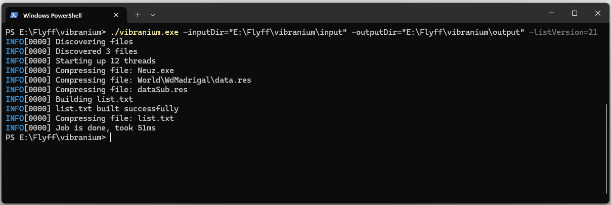

<!-- PROJECT LOGO -->
<br />
<p align="center">
  <h2 align="center">Vibranium</h2>
  <p align="center">
    <i>Next generation patch creation tool</i>
    <br/>
  </p>
  
</p>

**Vibranium** aims to be the next generation patch creation tool, replacing the old and slow Titanium. It is a CLI tool that'll be able to run on every platform such as Windows, Linux and MacOS.

## Features

- Automatic files discovery
- Multi-threading
- Progress output
- Efficient memory usage

## Getting started

You need to provide the tool with an input directory, typically your complete game client, and an output directory, that'll contain the generated list.txt, and NeuroSpace/RESCLIENT directory with all the gzipped files.

### On Windows (Powershell)

```sh
$ go build .
$ ./vibranium.exe -inputDir="C:\Input" -outputDir="C:\Output" -listVersion=21
```

### On Unix

```sh
$ go build .
$ ./vibranium -inputDir="/my/input" -outputDir="/my/output" -listVersion=21
```

## License

This project is licensed under the [GPL 3.0 license](./LICENSE).